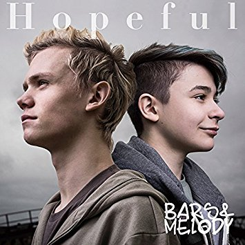
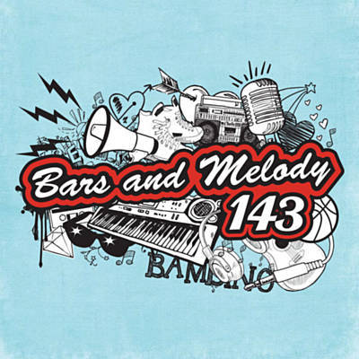
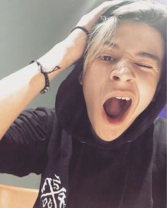

### Bars and Melody

Bars and Melody are a British pop/rap duo who first apeared on Britians Got Talent. Leondre Devries is known as "Bars". Charlie Lenehan is known as "Melody"
Bars and Melody (B.A.M.) are a British pop duo consisting of rapper Leondre "Bars" Devries and singer Charlie "Melody" Lenehan. They took part in the eighth series of Britain's Got Talent in 2014. During their audition, they were automatically sent into the semifinals of the competition after the head judge, Simon Cowell, pressed the "golden buzzer." They ultimately finished in third place in the series. They brought out a new song, "Shining Star", on 30 July 2014; this was an extra to their acoustic version of the song "Hopeful".Bars and Melody released their debut studio album 143 on 21 August 2015. It debuted at number four in the UK. One year later, their EP Teen Spirit was released.They refer to their fans as "Bambinos."

They have appeared in the United Kingdom, the United States, Japan, mainland Europe, and Australia. 

Bars and Melody are curently on their Generation Z tour in mainland Europe.
The photo below is one of their first albums when they first went big.
 
 
 

Leondre Devries met Charlie Lenehan on Facebook.
This is Leondre.

